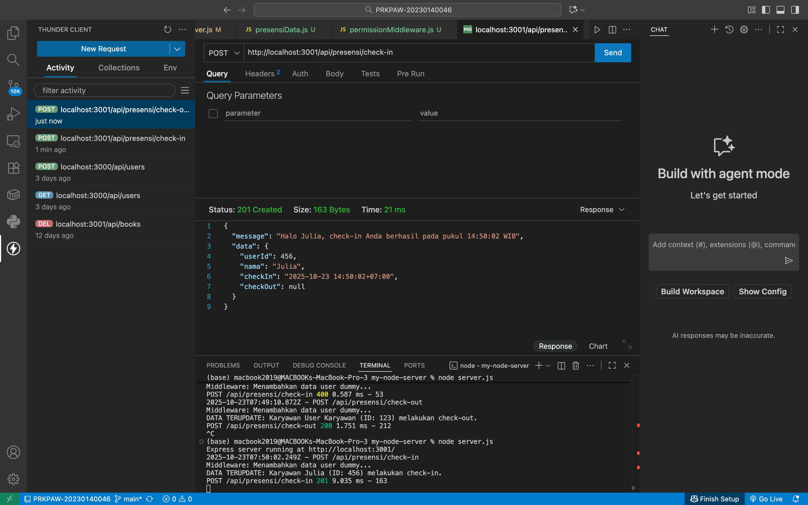
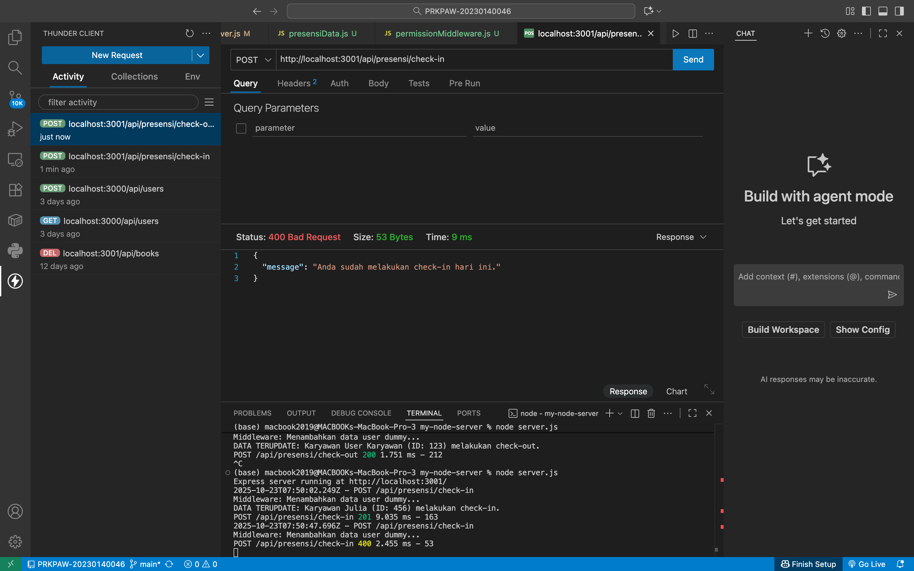
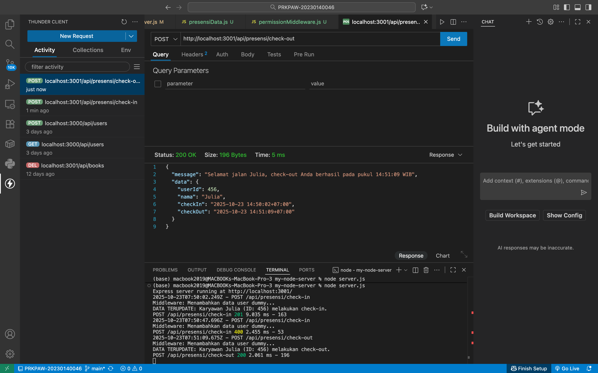
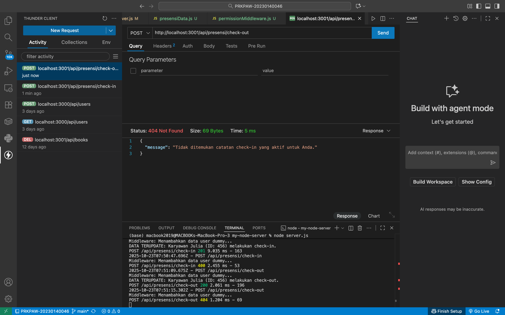
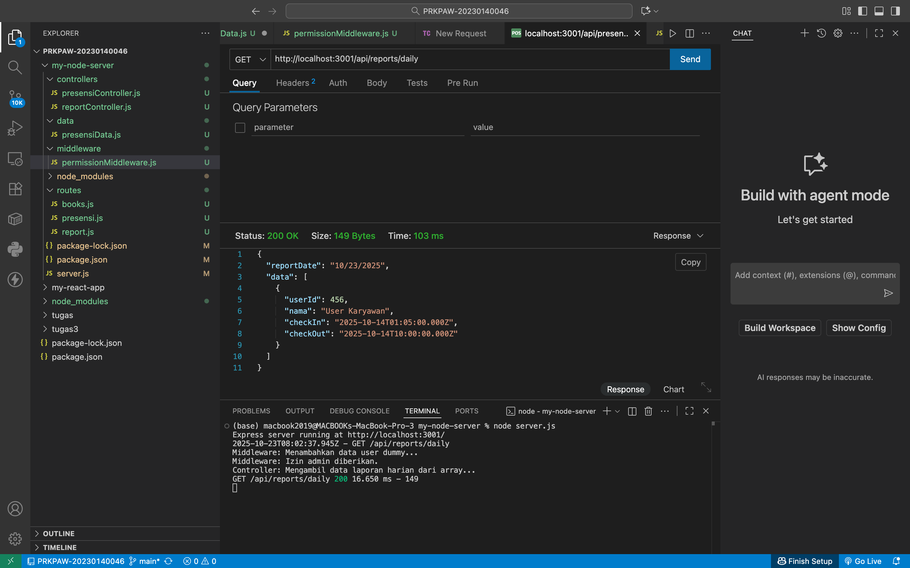

## 1. Tampilan Endpoint Presensi Check-in (POST)

## 2. Tampilan Endpoint Presensi Check-in lebih dari sekali (POST)

## 3. Tampilan Endpoint Presensi Check-out (POST)

## 4. Tampilan Endpoint Presensi Check-out belum melakukan check-in (POST)

## 4. Tampilan Endpoint reportsdaily (GET)

