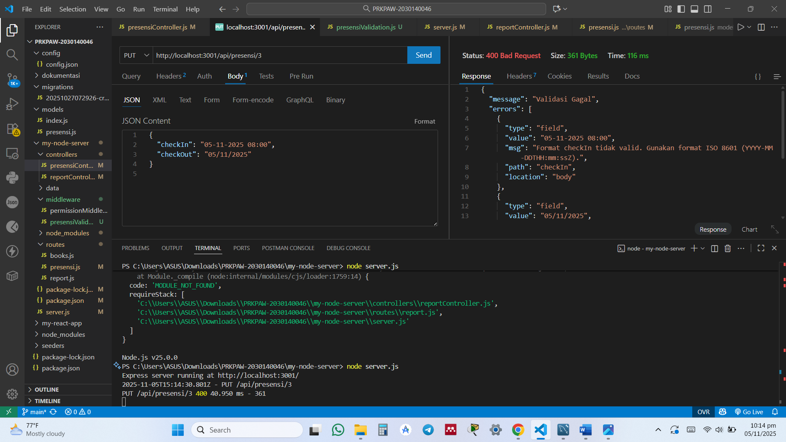
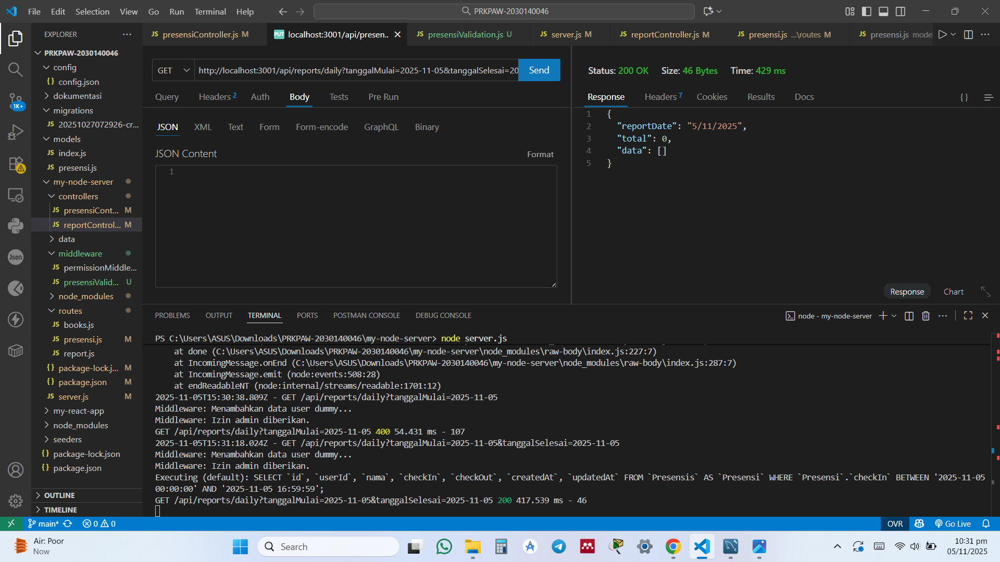

## 1. Endpoint update data presensi

## 2. Endpoint update jika format tanggal yang diisi tidak valid

## 3. Endpoint delete data

## 4. Enpoint search berdasarkan nama

## 5. Endpoint search berdasarkan tanggal
