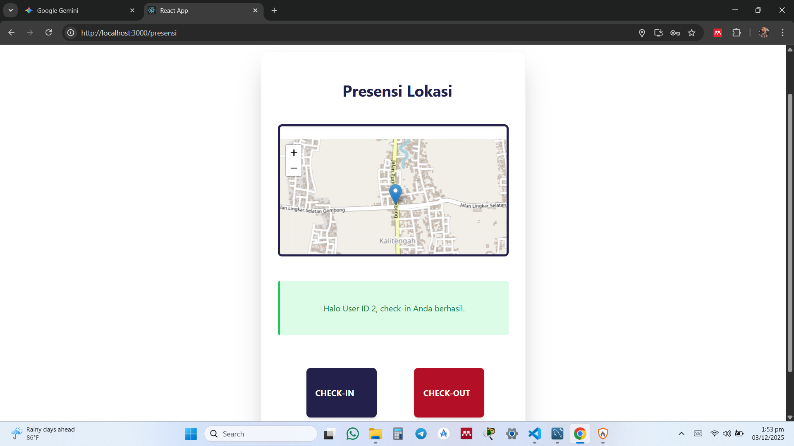
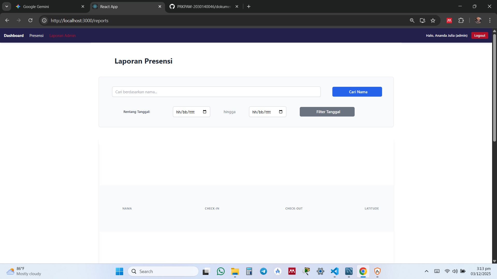
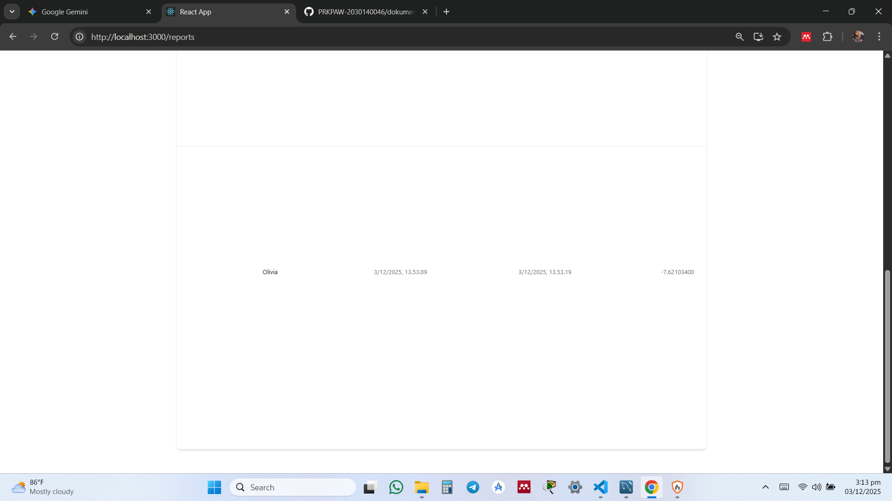
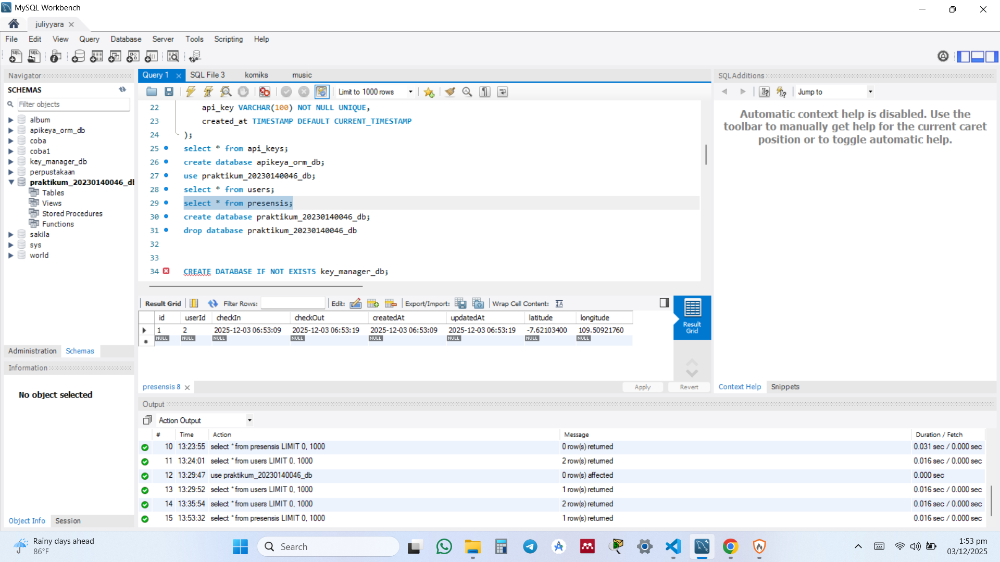
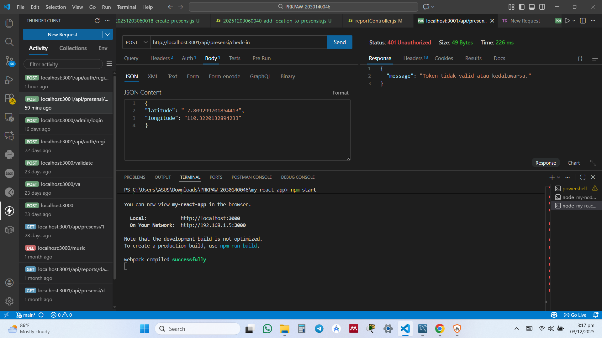

1. Check-in berhasil

2. Check-out berhasil

3. Tampilan halaman report yg berisi data presensi dari semua user

4. Screenshote tabel presensi di database

5. Tampilan Endpoint presensi/check-in dengan menggunakan bearer token dan body latitude, longitude
